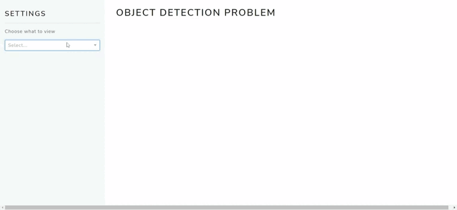
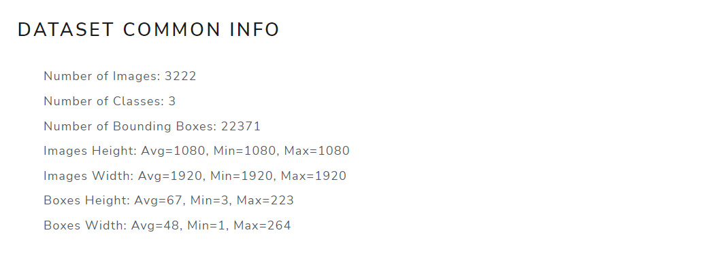
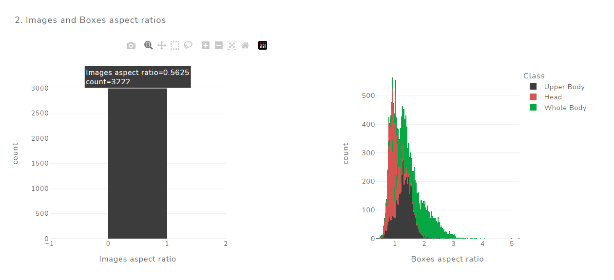
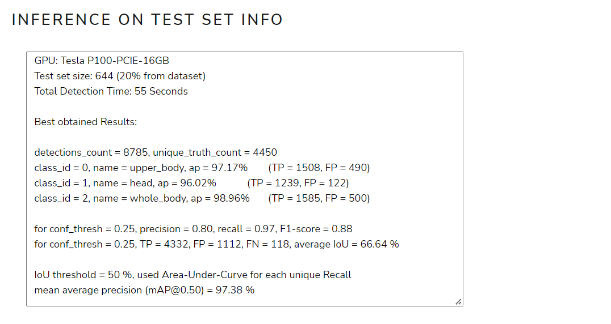

# Object Detection Problem
Test Assignment

<!-- TOC -->
* [Object Detection Problem](#object-detection-problem)
* [EDA](#eda)
  * [How to run dashboard](#how-to-run-dashboard)
  * [EDA Plots](#eda-plots)
* [Training Results](#training-results)
  * [Results visualization with dashboard](#results-visualization-with-dashboard)
  * [Information about Training](#information-about-training)
    * [hyperparameters](#hyperparameters)
    * [Train and Test set](#train-and-test-set)
    * [GPU and Training Time:](#gpu-and-training-time-)
    * [Metrics with best weights](#metrics-with-best-weights)
    * [Loss and mAP plots](#loss-and-map-plots)
    * [Predictions examples on test set images](#predictions-examples-on-test-set-images)
* [How to Train and Inference Net](#how-to-train-and-inference-net)
  * [Kaggle](#kaggle)
  * [Colab](#colab)
<!-- TOC -->

# EDA
- Был подготовлен dashboard с интерактивными графиками для более удобного анализа данных:

- также в нем есть возможность просмотреть все изображения из датасета с аннотацией или без нее:

## How to run dashboard
- dashboard запускается локально, для этого необходимо:
  - склонировать проект
  - в конфиге config.json изменить параметр ["dataset"]["data_path"] на путь до датасета (папки "dataset" из 
  описания тестового задания)
  - запустить main.py

## EDA Plots 

- Основная информация о датасете

- Информация об аннотации: 
  - доля изображений без аннотации 
  - доля объектов (боксов), приходящаяся на каждый из классов 

- Соотношения сторон (height/width) изображений и боксов

- Распределение количества боксов на изображение
- Распределение площадей боксов для каждого из классов

- Примеры изображений с аннотацией 
- класс Head обозначен красным цветом, Upper Body - фиолетовым, Whole Body - зеленым

# Training Results

## Results visualization with dashboard
- в dashboard также содержится информация о процессе обучения нейронной сети и о полученных результатах:

- также можно посмотреть примеры предсказаний обученной сети на случайных тестовых изображениях:

## Information about Training

### Hyperparameters
- были использованы рекомендуемые значения гиперпараметров
- по рекомендациям из документации darknet был увеличен размер входного изображения 
  (с [416, 416] до [512, 512], что позволило получить прирост в mAP с 97.29 % до 97.38 % и добавило 2 часа при обучении) 

- подробные метрики с размером изображения [416, 416]:

      detections_count = 8830, unique_truth_count = 4450  
      class_id = 0, name = upper_body, ap = 96.70%   	 (TP = 1506, FP = 488) 
      class_id = 1, name = head, ap = 96.19%   	 (TP = 1231, FP = 120) 
      class_id = 2, name = whole_body, ap = 98.97%   	 (TP = 1584, FP = 479) 

      for conf_thresh = 0.25, precision = 0.80, recall = 0.97, F1-score = 0.88 
      for conf_thresh = 0.25, TP = 4321, FP = 1087, FN = 129, average IoU = 67.07 % 

      IoU threshold = 50 %, used Area-Under-Curve for each unique Recall 
      mean average precision (mAP@0.50) = 0.972875, or 97.29 % 
      Total Detection Time: 55 Seconds

- подробные метрики с размером изображения [512, 512]:

      detections_count = 8785, unique_truth_count = 4450  
      class_id = 0, name = upper_body, ap = 97.17%   	 (TP = 1508, FP = 490) 
      class_id = 1, name = head, ap = 96.02%   	 (TP = 1239, FP = 122) 
      class_id = 2, name = whole_body, ap = 98.96%   	 (TP = 1585, FP = 500) 

      for conf_thresh = 0.25, precision = 0.80, recall = 0.97, F1-score = 0.88 
      for conf_thresh = 0.25, TP = 4332, FP = 1112, FN = 118, average IoU = 66.64 % 

      IoU threshold = 50 %, used Area-Under-Curve for each unique Recall 
      mean average precision (mAP@0.50) = 0.973817, or 97.38 % 
      Total Detection Time: 55 Seconds

- при использовании размера больше 512, памяти использованных GPU было недостаточно

### Train and Test sets

    Train set size: 2578 (80% from dataset)
    Test set size: 644 (20% from dataset)

### GPU and Training Time:
  
    GPU: Tesla P100-PCIE-16GB (Kaggle), Tesla T4 16gb (Google Colab)
    Training time on Kaggle: ~ 25 h
    Training time on Google Colab: ~ 26 h
    Number of Iterations: 6000

[//]: # (![img.png]&#40;training_process_plots/1.PNG&#41;)

### Metrics with best weights 

### Loss and mAP plots

- Значения целевой функции в процессе обучения нейронной сети

- Значения mAP в процессе обучения нейронной сети (валидация происходила на тестовых данных)

### Predictions examples on test set images

- Визуализация в dashboard

- Другие примеры

# How to Train and Inference Net

- общая информация об обучении (гиперпараметры, время, гпу и тд)
- ссылки на ноутбуки с инструкциями
- графики с обучения
- что пробовала менять
- что бы хотела попробовать дальше

## Kaggle 
- Tesla P100 16gb
- Training time: ~ 25 hours (6000 iterations)
- https://www.kaggle.com/railyavaliullina/testassignment

## Colab
- Tesla T4 16gb
- Training time: ~ 27 hours (6000 iterations)
- https://colab.research.google.com/drive/1NtEQRal8Yu_0k1TlSTvFIen5VBGEiEpj?usp=sharing
